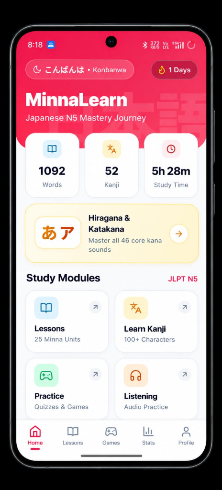

# MinnaLearn (みんなラーン) — Japanese JLPT N5 Learning App

<p align="center">
  
</p>

<p align="center">
  <strong>The colorful, gamified, and fun way to master Japanese JLPT N5!</strong><br />
  25 structured <em>Minna no Nihongo</em> lessons, interactive Kanji stroke tracing, native audio vocabulary, and daily streak quests.
</p>

<p align="center">
  <a href="https://play.google.com/store/apps/details?id=com.maadhu.minnalearn">
    
  </a>
  <a href="https://getminnalearn.xyz">
    
  </a>
  <a href="https://github.com/Maadhu938/MinnaLearn-FlutterApp/releases">
    
  </a>
  <a href="https://flutter.dev">
    
  </a>
  
</p>

---

## 📱 Quick Links

- 🌐 **Official Website:** [https://getminnalearn.xyz](https://getminnalearn.xyz)
- 📲 **Google Play Store:** [Download on Google Play](https://play.google.com/store/apps/details?id=com.maadhu.minnalearn)
- 🔒 **Privacy Policy:** [https://getminnalearn.xyz/privacy-policy.html](https://getminnalearn.xyz/privacy-policy.html)
- 🗑️ **Account Deletion:** [https://getminnalearn.xyz/delete-account.html](https://getminnalearn.xyz/delete-account.html)

---

## 📸 App Preview

<p align="center">
  
</p>

---

## ✨ Key Features

### 📚 25 Structured Lessons (Minna no Nihongo Curriculum)
- **1,000+ Native Vocabulary Words** with native audio recordings and pitch accent clarity.
- **100+ JLPT N5 Kanji** with Kun'yomi & On'yomi readings, stroke counts, and meaning flashcards.
- **Grammar Explanations & Patterns** for all 25 lessons loaded offline.
- **Lesson Progress Tracking** (0% to 100% completion per lesson).

### 🖌️ Interactive Kanji Stroke Tracing Studio
- **Stroke-by-Stroke Animation**: Watch the exact order and direction of every Kanji stroke.
- **Guided Finger Tracing Canvas**: Smooth gesture-locked canvas preventing accidental page scrolling.
- **Stroke Dictionary**: Numbered sequence badges and real-time tracing feedback.

### 🎨 Global Japanese Font Customization
- Choose between **6 authentic Japanese typography styles** across the entire app:
  - *Modern Sans* (Noto Sans JP)
  - *Classic Mincho* (Shippori Mincho)
  - *Rounded Cute* (Zen Maru Gothic)
  - *Historical Serif* (Kaisei Tokumin)
  - *Casual Handwriting* (Yomogi)
  - *Poster Display* (Dela Gothic One)
- Dynamically styles vocabularies, flashcards, Kanji diagrams, grammar patterns, and quizzes.

### 🎮 Gamified Mini-Games
- **⚡ Matching Game**: Rapidly match Japanese kana/kanji with English definitions against the clock.
- **🎯 True or False**: Fast-fire quick reaction drill for vocabulary accuracy.
- **⌨️ Typing Test**: Speed typing test to reinforce active recall.
- **🧩 Kana Puzzle**: Drag-and-drop syllable construction.

### 📊 Quests, Streaks & Mastery Stats
- **Daily Streak Counter**: Keep up your daily habit and streak rewards.
- **Weekly Study Time Analytics**: Track total study minutes and weekly performance trends.
- **Mastery Meters**: Track vocabulary retention and Kanji mastery over time.
- **Kotowaza of the Day**: Rotating daily Japanese proverbs with full audio and English wisdom translations.

### ☁️ Cloud Sync & Offline Support
- **100% Offline Capability**: Built with SQLite (sqflite) — study on airplanes, trains, or subways without internet.
- **Cloud Sync**: Firebase Authentication (Google Sign-In & Email) + Cloud Firestore backup for streaks, achievements, and bookmarks.

---

## 🛠️ Project Structure

```text
MinnaLearn/
├── docs/                                # Official Website & GitHub Pages (getminnalearn.xyz)
│   ├── index.html                       # Landing page with SEO, Schema.org, & interactive preview
│   ├── privacy-policy.html              # Google Play compliant Privacy Policy
│   ├── delete-account.html              # Account & data deletion request portal
│   ├── robots.txt                       # Search engine crawler directives
│   ├── sitemap.xml                      # XML sitemap for Google Search Console
│   ├── CNAME                            # Custom domain configuration (getminnalearn.xyz)
│   └── favicon.ico                      # Multi-resolution Google-compliant favicon suite
├── flutter_minnalearn/
│   ├── android/                         # Android native config (SDK 34+, ProGuard, Keystore)
│   ├── assets/                          # Vocab files, grammar notes, audio clips, and vector graphics
│   └── lib/
│       ├── data/                        # N5 Kanji data & stroke path dictionaries
│       ├── models/                      # Lesson, Vocabulary, and Kanji models
│       ├── screens/                     # UI screens (Home, Lessons, Kanji, Games, Quizzes, Stats)
│       ├── services/                    # Database (SQLite), Cloud (Firestore), Font, TTS, Audio
│       ├── utils/                       # AppTheme design tokens, gradients, and typography
│       └── widgets/                     # Kanji tracing canvas, custom dialogs, bouncing buttons
└── README.md
```

---

## 💻 Tech Stack

| Component | Technology |
|---|---|
| **Framework** | [Flutter](https://flutter.dev) (Dart 3) |
| **Local Database** | SQLite via [sqflite](https://pub.dev/packages/sqflite) |
| **Authentication** | [Firebase Auth](https://firebase.google.com/products/auth) (Google Sign-In & Email) |
| **Cloud Sync** | [Cloud Firestore](https://firebase.google.com/products/firestore) |
| **Notifications** | [flutter_local_notifications](https://pub.dev/packages/flutter_local_notifications) |
| **Audio & TTS** | [audioplayers](https://pub.dev/packages/audioplayers) & [flutter_tts](https://pub.dev/packages/flutter_tts) |
| **Typography** | [Google Fonts](https://fonts.google.com) (Outfit, Plus Jakarta Sans, Noto Sans JP, Shippori Mincho) |
| **Vector Icons** | [Lucide Icons](https://lucide.dev) |

---

## 🚀 Getting Started

### Prerequisites
- [Flutter SDK](https://docs.flutter.dev/get-started/install) (`>= 3.22.0`)
- [Android Studio](https://developer.android.com/studio) / Android SDK (`API 34+`)
- Java JDK 17

### Installation

1. **Clone the repository:**
   ```bash
   git clone https://github.com/Maadhu938/MinnaLearn-FlutterApp.git
   cd MinnaLearn-FlutterApp/flutter_minnalearn
   ```

2. **Install Flutter packages:**
   ```bash
   flutter pub get
   ```

3. **Run on an Android device or emulator:**
   ```bash
   flutter run
   ```

### Production Build

```bash
# Build Android App Bundle for Google Play Store:
flutter build appbundle --release

# Build standalone Release APK:
flutter build apk --release
```

---

## 📄 License

This project is licensed under the **MIT License** — see the [LICENSE](LICENSE) file for details.

---

<p align="center">
  Crafted with ❤️ for Japanese learners worldwide.<br />
  <strong>MinnaLearn</strong> — <a href="https://getminnalearn.xyz">https://getminnalearn.xyz</a>
</p>
